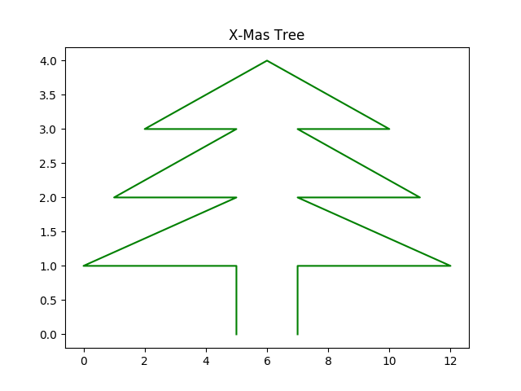

_Übungsaufgabe zur Veranstaltung [IT
Systeme](https://hsro-wif-it.github.io) im [Bachelorstudiengang
Wirtschaftsinformatik](https://www.th-rosenheim.de/technik/informatik-mathematik/wirtschaftsinformatik-bachelor/) an der [Hochschule Rosenheim](http://www.th-rosenheim.de)._

# 11 - Weihnachtsübung - Python 

Diese Übung behandelt das Thema _Python Basics_ und soll vor allem Spaß machen.

> Note: **Die Lösung befindet sich im Branch _Musterlösung_.**

Zum Durchführen der Übung können Sie entweder:
- ihre lokale Python Umgebung nutzen
- [Azure Notebooks](https://notebooks.azure.com/)
- [Google](https://colab.research.google.com)
- [Repl.it](https://repl.it/)

## Aufgabe 1: Ein ganzer Weihnachtsbaum

Nachdem wir in der Vorlesung bereits einen halben Weihnachtsbaum ausgeben konnten, versuchen wir nun einen ganzen Baum zu drucken.

Der Baum soll nachher wie folgt aussehen:

```shell
      +
     +++
    +++++
   +++++++
  +++++++++
 +++++++++++
+++++++++++++
     | |
```

Schreiben Sie eine Methode `def xmastree(n):`, die einen Parameter `n` erhält, der die Höhe des Baumes bestimmt. Die Beispielbaum hat eine Höhe von 7.

> Note: Die Klasse string hat eine Methode `center`. Hier ist, was das Netz über die Methode sagt:

```shell
string.center(length[, fillchar])

Parameters:
length   : length of the string after padding with the characters.
fillchar :(optional) characters which needs to be padded.If it's not provided, space is taken as default argument.

Returns:
returns a string padded with specified fillchar and it doesn't modify 
the original string.

```

## Aufgabe 2: Ein Matplotlib-Weihnachtsbaum

In der Vorlesung hatten Sie gesehen, wie einfach es ist mit Python eine Funktion zu plotten. Schreiben Sie ein Skript, dass einen Weihnachtsbaum plotted.

Dieser könnte wie folgt aussehen:



Verwenden Sie hierzu die Library `matplotlib`.

## Aufgabe 3: Python-Weihnachtsgrüße

Gegeben ist eine Datei mit Namen und Alter. Dies sieht, wie folgt aus:

```shell
Name, Alter, Geschlecht
Max Mustermann, 33, m
Benjamin Mustermann, 9, m
Ulrike Mustermann, 3, w
...
```

Stellen Sie sich sich vor, sie sind Weihnachtsmann*frau und müssen jeder Person der Liste Weihnachtsgrüße schicken, aber nur, wenn die Person jünger als 10 und älter als 3 ist.

Schreiben Sie ein Programm, das die Datei `Name.txt` einliest (die Datei befindet sich in [](./data/Namen.txt) und für jede Zeile, bei der die Bedingung gilt eine Ausgabe in die Datei `Gruesse.txt` schreibt. In der Datei `Gruesse.txt` steht dann in jeder Zeile ein Gruss für die relevanten Kinder. Die Grusszeile soll die Form

`Frohe Weihnachten vom Weihnachts[mann|frau], lieber <Vorname>`

haben.

### Aufgabe 4: Frohe Weihnachten!

**Daniel und ich wünschen Ihnen schöne Weihnachtstage und einen guten Rutsch ins neue Jahr!**